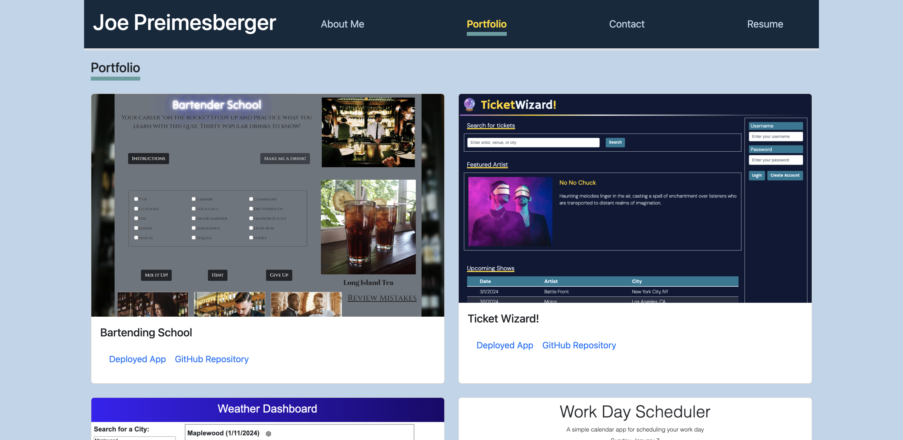

# React Portfolio

## Description

The purpose of this project was to create a portfolio using React to help distinguish myself from other developers whose portfolios don’t use the latest technologies.

## Installation

The project repository can be found at the following GitHub Page: https://github.com/j-preim/react-portfolio

The deployed application can be found deployed on Netlify here: https://rainbow-bubblegum-4538b0.netlify.app/portfolio

## Usage

The website will appear as it does in the following screenshot:

## Credits

N/A

## License

Copyright (c) 2024 Joe Preimesberger

Licensed under the MIT license.